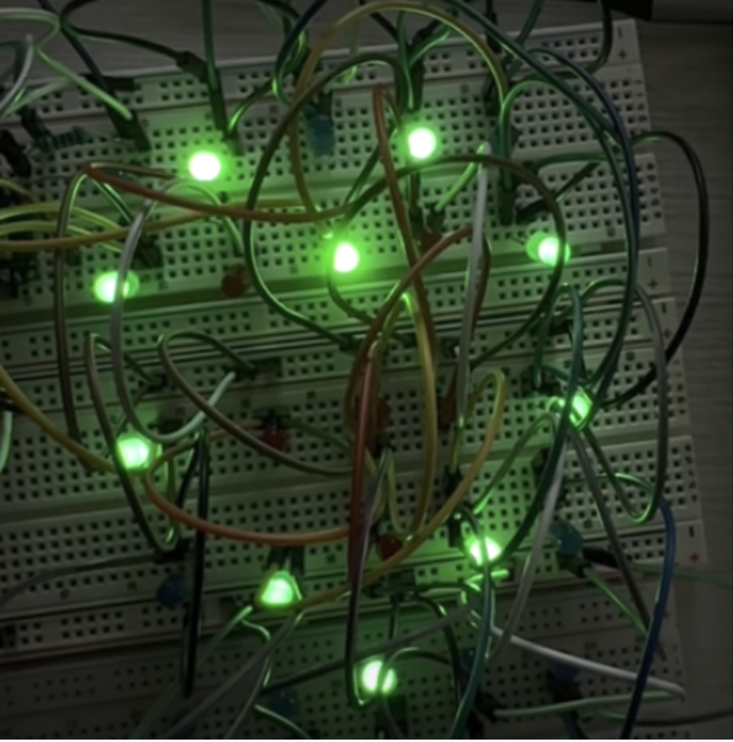
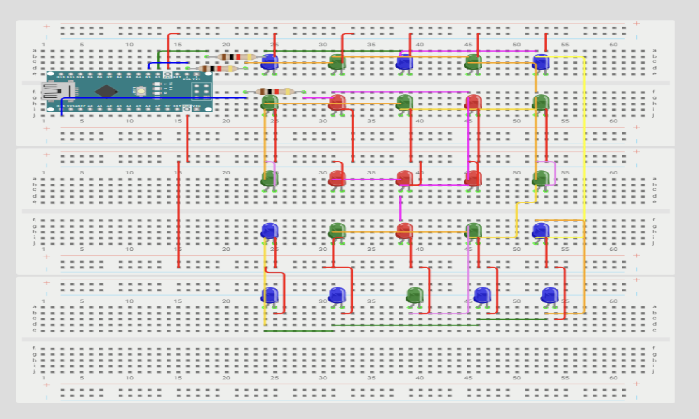

## Demo

<p align="center">
  <a href="https://www.youtube.com/shorts/5sUCpxtb52w">
    
  </a>
</p>

Click the button. Say nothing, "Red", "Green", or "Blue" and the corresponding LEDs light up.
**[Watch Demo](https://www.youtube.com/shorts/5sUCpxtb52w)**

---

## Overview

A voice-controlled 5x5 LED matrix that responds to spoken color commands. The system runs a TinyML model directly on the microcontroller for real-time speech recognition.

Inspired by the immersive light shows at Gardens by the Bay and the National Museum of Singapore.

---

## System Architecture

```
┌──────────┐    ┌─────────┐    ┌─────────────┐    ┌─────────────┐    ┌─────────────┐    ┌────────────┐
│  Button  │───▶│  Human  │───▶│ Microphone  │───▶│ Edge        │───▶│  Arduino    │───▶│  5x5 LED   │
│  Press   │    │  Voice  │    │ (MP34DT05)  │    │ Impulse ML  │    │  Nano 33    │    │  Matrix    │
└──────────┘    └─────────┘    └─────────────┘    └─────────────┘    └─────────────┘    └────────────┘
                                                         │
                                                  ≥60% confidence
                                                  triggers output
```

The button activates the microphone for voice capture. Then Edge Impulse ML model classifies speech (Blue / Red / Green / None), and the arduino outputs the 5x5 LED matrix displays corresponding color pattern.

---

## Technical Highlights

**Embedded ML**
- Deployed TinyML model on Arduino Nano 33 BLE Sense
- 95.6% classification accuracy on voice commands
- 60% confidence threshold tuned through empirical testing
- Real-time inference with no cloud dependency

**Hardware Optimization**
- Reduced pin usage from 25 → 3 by grouping same-color LEDs
- Eliminated need for second microcontroller
- Clean circuit design on breadboard prototype

**Evaluation**
- Tested across quiet (hallway) and noisy (classroom) environments
- Achieved 90% accuracy in quiet conditions, 60% in noisy
- Identified "Red" as lowest-accuracy command via confusion matrix analysis

---

## Tech Stack

**Hardware** Arduino Nano 33 BLE Sense, MP34DT05 MEMS microphone, 5x5 LED matrix 

**ML Platform** Edge Impulse (data collection, training, deployment) 

**Firmware** C++

**Dataset** 4-class audio classification (Blue, Green, Red, None) 

---

## Results

**Confusion Matrix (Edge Impulse Model)**

|  | BLUE | GREEN | NOT_WORD | RED |
|---|:---:|:---:|:---:|:---:|
| **BLUE** | **100%** | 0% | 0% | 0% |
| **GREEN** | 0% | **100%** | 0% | 0% |
| **NOT_WORD** | 5.6% | 11.1% | **83.3%** | 0% |
| **RED** | 0% | 5.3% | 2.6% | **92.1%** |
| **F1 Score** | 0.99 | 0.95 | 0.88 | 0.96 |

**Real-World Testing**

| Environment | Blue | Green | Red |
|-------------|:----:|:-----:|:---:|
| Quiet (hallway) | 9/10 | 8/10 | 6/10 |
| Noisy (classroom) | 6/10 | 6/10 | 4/10 |

**Key findings:**
I found that background noise significantly impacts recognition accuracy, and "Red" consistently underperforms, which
aligns with my confusion matrix predictions. My solution is to implement directional microphone cone to isolate voice input,
and train Edge Impulse ML on a more robust voice dataset.

---

## Getting Started

### Hardware Required
- Arduino Nano 33 BLE Sense
- 15 LEDs (5 red, 5 green, 5 blue)
- Resistors, breadboard, jumper wires
- Push button

### Breadboard setup
<p align="center">
  
</p>

### Software Setup

1. Clone this repository
   ```bash
   git clone https://github.com/your-username/sound-activated-light-show.git
   ```

2. Import the Edge Impulse model
   - Open [Edge Impulse Studio](https://studio.edgeimpulse.com/)
   - Deploy to Arduino library

3. Flash the Arduino
   ```bash
   # Open in Arduino IDE and upload to board
   ```

---

## References

- [Edge Impulse + Arduino Tutorial](https://docs.arduino.cc/tutorials/nano-33-ble-sense/edge-impulse/)
- [CloudColourSounds Dataset](https://mltools.arduino.cc/public/215176/latest)
- [Smart Cities & Digital Trust (IEEE)](https://doi.org/10.1109/scfc62024.2024.10698207)

